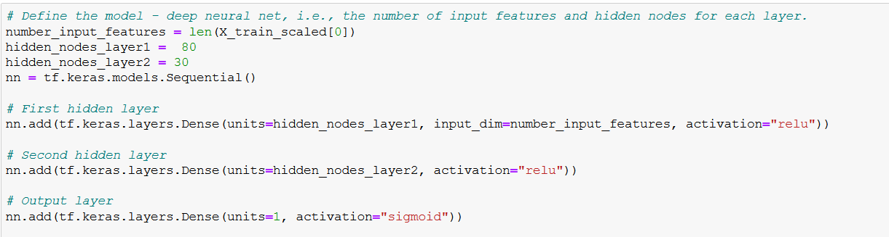
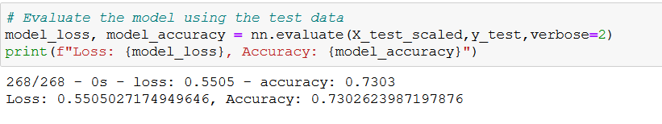

# Neural_Network_Charity_Analysis
## Overview of Analysis
The goal of this analysis is to create a nueral network model that is capable of predicting whether applicants will be successful if funded by Alphabet Soup. The data contains more than 34,000 organizations that have received funding over the years. 
## Results
### Data Preprocessing
* What variable(s) are considered the target(s) for your model?

  The target variable is the IS_SUCCESSFUL column.

* What variable(s) are considered to be features for your model?

  All the variable except the ones that will be dropped.

* What variable(s) are neither the targets nor features, and should be removed from the input data?

  The non-beneficial ID columns, 'EIN' and 'NAME'.

### Compiling, Training, and Evaluating the Model
* How many neurons, layers, and activation functions did you select for your neural model and why?
 
 Two hidden layer with 80 neurons in the first layer and 30 in the second layer were selected. We chose ReLu activation for the hidden layer and sigmoid for the output.

* Were you able to achieve the target model performance?
 
 No, not able to. Got an accuracy of 73%

* What steps did you take to try and increase model performance?
 
 Changed the neuron layer and epochs. However, not a significant change was seen. 

## Summary
The model was not able to achieve 75% accuracy. Perhaps by using another model and having more data the accuracy might be able to be achieved. 
